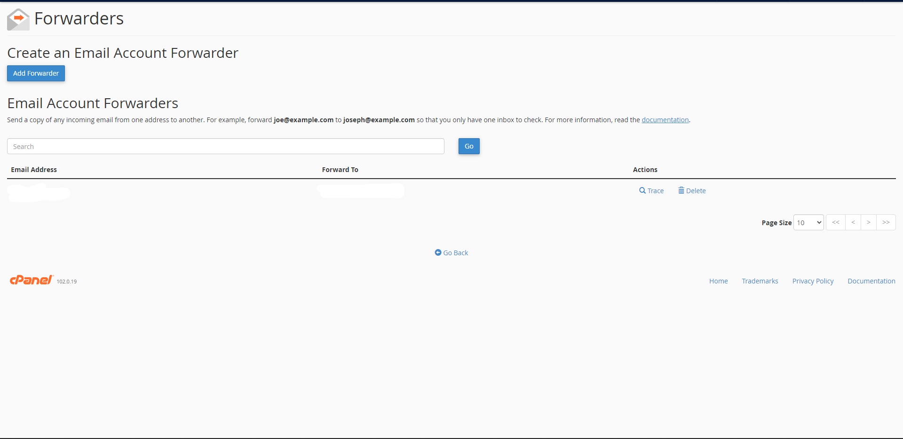

# CPanel Email Setup
### This guide will help you set up your CPanel account so that you can use Gmail to send and receive emails.
---
 

> When your Y-knot email is created, a few automated messages will be sent to your pre-specified email address. One of the emails that you have received will let you set a password for the **new account**, and the other email contains the client configuration settings for your new account.

 

- You first want to pick a password for your new account by clicking on the link provided by the first email from CPanel. (If the link from CPanel expires, you can navigate to [this link](https://y-knot.io:2083/) and use the **Forget Password** option)

- Once you have chosen a password for your y-knot email, following the steps on [this link](https://hollypryce.com/cpanel-gmail/#:~:text=To%20do%20this%2C%20head%20over,'re%20done%2C%20click%20Next.), up until the following header: **4. Authenticate your email address**. The instructions in this section will not be required for you to do.

- After you have completed the steps outlined in the link above, there are a few changes you should make on both your CPanel webclient and Gmail.

---

#### **1.** Navigate to your CPanel webclient. You can do this by clicking on [this link](https://y-knot.io:2083/). Enter the username (it will be your new email address) and the password that you have specified. If the login was successful, you should see a screen that looks like this:

#### **2.** Once you are on this screen, click on the **Forwarders** option, situated at the bottom-middle of the screen.

 

#### **3.** After that, you add a new Forwarder using the Gmail account that you had to create from the steps in the link above.

This will send a copy of any email that you have received on your CPanel account to your Gmail. If you get duplicate emails sent to your Gmail account, you can either remove this Forwarding option from CPanel, or from the Settings in your Gmail account.

---

### The last part is to set your Y-knot email as the defualt account to use on your Gmail. 

- To do this, log into your newly created Gmail account that you are using for work, and click on the **Settings** cog button at the top right of the screen. Then click on **See all settings**.

- This should open the Settings page with multiple tabs at the top. Click on the **Accouts and Imports** tab.

- In the **Send mail as:** section, at least two email addresses should be displayed: your current gmail address and your Y-knot address. Set your Y-knot account as the default by clicking on the ***make default*** button to the right of the screen.

- Another optional setting would be just below your listed email accounts labeled **When replying to a message**. Set it to ***Reply from the same address the message was sent to***.

---

All these steps should successfully set up your Y-knot account to work synchronously with Gmail.